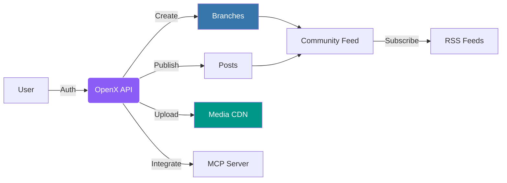

<div align="center">
<<<<<<< HEAD
  <br/>
  <h1>OpenX</h1>
=======
  &nbsp;
  <br/>
>>>>>>> b37cdfa (docs(readme): add icon and logo to header, remove text title)
  <p>
    <strong>Communities without boundaries.</strong><br>
    A modern, Reddit-like social platform built with FastAPI.
  </p>

  <a href="https://www.python.org/">
    
  </a>
  <a href="https://fastapi.tiangolo.com/">
    
  </a>
  <!--<a href="https://github.com/QluxLab/OpenX/blob/main/LICENSE">
    
  </a>
  <a href="https://github.com/QluxLab/OpenX/releases">
    
</div>

<br />

---

## Quick Start

Get up and running in seconds.

```bash
# Clone & install
git clone https://github.com/QluxLab/OpenX.git
cd OpenX
uv sync

# Run
uv run uvicorn src.app:app --reload --host 0.0.0.0 --port 8000
```

**Docker:**
```bash
docker build -t openx .
docker run -p 8000:8000 -v openx_data:/app/.data openx
```

---

## What is OpenX?

**OpenX** is a self-hosted social platform inspired by Reddit. Create branches (communities), share posts, engage through comments, and build your own corner of the internet.

### The Flow



---

## Features

| Capability | Description |
| :--- | :--- |
| **Authentication** | Secret key-based auth with recovery keys and HttpOnly cookies. |
| **Branches** | Subreddit-style communities with moderation tools and audit logs. |
| **Posts** | Text, image, and video posts with threaded comments. |
| **Media Uploads** | Image and video uploads served via CDN. |
| **RSS Feeds** | Global, branch, and user-specific syndication. |
| **MCP Server** | AI assistant integration via Model Context Protocol. |

---

## Configuration

| Variable | Default | Description |
|----------|---------|-------------|
| `OPENX_DEBUG` | `false` | Enable debug mode |
| `OPENX_DB_URL` | `sqlite:///.data/openx.db` | Database URL |
| `OPENX_CDN_URL` | `http://localhost:8000/cdn` | CDN base URL |
| `OPENX_CDN_PATH` | `./.data/uploads` | Upload storage path |
| `OPENX_TRUSTED_PROXIES` | — | Comma-separated proxy IPs |

---

## API Reference

<details>
<summary><strong>Authentication</strong></summary>

| Method | Endpoint | Description |
|--------|----------|-------------|
| `POST` | `/api/auth/new` | Create account |
| `POST` | `/api/auth/verify` | Login |
| `POST` | `/api/auth/recovery` | Recover account |
| `POST` | `/api/auth/logout` | Logout |

</details>

<details>
<summary><strong>Branches</strong></summary>

| Method | Endpoint | Description |
|--------|----------|-------------|
| `POST` | `/api/branch/create` | Create branch |
| `GET` | `/api/branch/{branch}` | Get branch info |
| `POST` | `/api/branch/{branch}/posts` | Create post |
| `GET` | `/api/branch/{branch}/posts` | List posts |

</details>

<details>
<summary><strong>Posts</strong></summary>

| Method | Endpoint | Description |
|--------|----------|-------------|
| `POST` | `/api/user/posts/` | Create |
| `GET` | `/api/user/posts/{id}/` | Read |
| `PATCH` | `/api/user/posts/{id}/` | Update |
| `DELETE` | `/api/user/posts/{id}/` | Delete |

</details>

<details>
<summary><strong>Comments</strong></summary>

| Method | Endpoint | Description |
|--------|----------|-------------|
| `POST` | `/api/comments/{post_id}` | Create |
| `GET` | `/api/comments/{post_id}` | List |
| `DELETE` | `/api/comments/{comment_id}` | Delete |

</details>

<details>
<summary><strong>Media</strong></summary>

| Method | Endpoint | Description |
|--------|----------|-------------|
| `POST` | `/api/media/upload` | Upload |
| `GET` | `/api/media/list` | List |
| `DELETE` | `/api/media/{id}` | Delete |

</details>

<details>
<summary><strong>RSS Feeds</strong></summary>

| Endpoint | Description |
|----------|-------------|
| `/feed.rss` | Global feed |
| `/b/{branch}.rss` | Branch feed |
| `/u/{username}.rss` | User feed |

</details>

---

## Project Structure

```
src/
├── app.py                 # Application entry
├── api/
│   ├── cdn.py             # CDN endpoint
│   ├── rss.py             # RSS feeds
│   ├── mcp/               # AI integration
│   └── v0/                # API v0
│       ├── auth/
│       ├── branch/
│       ├── user/
│       ├── comment/
│       └── media/
├── core/
│   ├── security.py        # Crypto & hashing
│   ├── rate_limit.py
│   ├── middleware.py      # CSRF, headers
│   └── db/                # Models
└── frontend/
    ├── static/            # CSS, JS
    └── templates/         # Jinja2
```

---

## Tech Stack

| Component | Technology |
|-----------|------------|
| Runtime | Python 3.13+ |
| Framework | FastAPI |
| Database | SQLAlchemy (SQLite) |
| Templates | Jinja2 |
| Server | Uvicorn |

---

## Testing

```bash
uv run pytest              # Run tests
uv run pytest --cov        # With coverage
```

---

## Contributing

Pull requests welcome.

1. Fork it
2. Branch it (`git checkout -b feature/something-new`)
3. Commit it
4. Push it
5. Open a PR

---

<div align="center">
  <p>MIT License</p>
  
</div>
